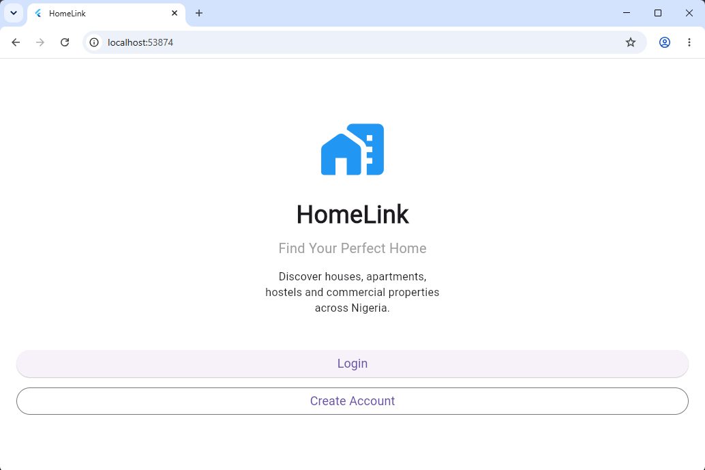

# HomeLink

HomeLink is a Flutter and Firebase property discovery, rental, and booking platform built for the Nigerian property market, with room to expand internationally.



## Project status

HomeLink is under active development. This repository documents my hands-on Flutter development work and the decisions behind the application. I can explain the code structure, Firebase integration, user flows, and features implemented here.

## Current features

- Email/password registration and login
- Email-verification flow
- Role-aware user profiles
- Real-time property listings from Cloud Firestore
- Search, category filters, price filters, and sorting
- Property creation, editing, availability updates, and deletion
- Property image uploads with Firebase Storage
- GPS capture for property locations
- Owner and tenant-specific actions
- Inspection-request workflow
- One-to-one property messaging
- Responsive Flutter targets for web, Android, iOS, Windows, macOS, and Linux

## Technology

- Flutter and Dart
- Firebase Authentication
- Cloud Firestore
- Firebase Storage
- FlutterFire
- Geolocator
- Image Picker
- Git and GitHub

## Project structure

- `lib/models` — application data models
- `lib/services` — authentication, database, storage, and chat services
- `lib/screens` — feature screens and user flows
- `lib/widgets` — reusable interface components
- `lib/utils` — formatting and helper utilities

## Local setup

1. Install Flutter and confirm the environment with `flutter doctor`.
2. Clone this repository.
3. Run `flutter pub get`.
4. Create or select a Firebase project.
5. Run `flutterfire configure` to generate the local Firebase configuration files.
6. Enable Email/Password Authentication, Cloud Firestore, and Firebase Storage.
7. Run the application with `flutter run`.

Firebase configuration files are intentionally excluded from version control.

## Quality checks

Run:

```bash
flutter analyze
```

Then test the relevant target, for example:

```bash
flutter run -d chrome
```

## Developer

**Harrison Nwaikwu**  
Flutter/Firebase developer and technical support professional based in Asaba, Delta State, Nigeria.
